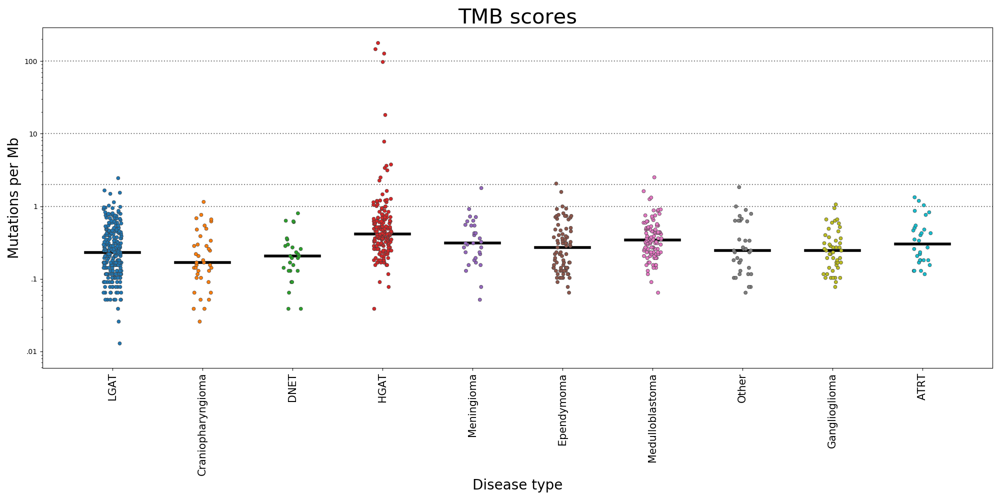
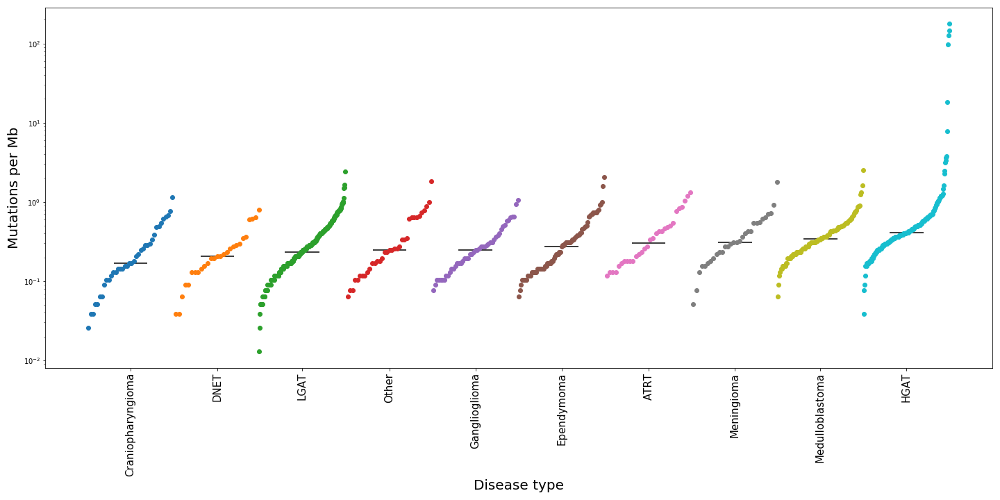

## TMB analysis

This analysis computes tumor mutation burden for different disease types

### Calculate TMB scores
  1. Reads the MAF file -
      - Calculates VAF
      - Filters based on variant_classification column
      - Uses pybedtools to only filter variants within target BED

  2. Calculates TMB
      - Calculates TMB based on ((# of variants)*1000000) / size of BED
      - Add histology type from metadata file and write to outfile

   `Usage`: python3 01_calculate_tmb.py [-h] -i MAF_FILE -m METADATAFILE -d DISEASE_COL -s
                           SAMPLE_COL -t TARGET_BED -c CDS_BED -o OUTFILENAME

          optional arguments:
          -h, --help            show this help message and exit
          -i MAF_FILE, --maf_file MAF_FILE
                        path to the MAF file
          -m METADATAFILE, --metadatafile METADATAFILE
                        path to the metadata/histology file
          -d DISEASE_COL, --disease_col DISEASE_COL
                        Disease column name in metadatafile
          -s SAMPLE_COL, --sample_col SAMPLE_COL
                        Sample column name in metadatafile
          -t TARGET_BED, --target_bed TARGET_BED
                        target_bed
          -c CDS_BED, --cds_bed CDS_BED
                        cds_bed
          -o OUTFILENAME, --outfilename OUTFILENAME
                        Out file name

   `Output` :

   - [output/pbta-mutect2-tmb_withintarget.txt](https://github.com/d3b-center/d3b-bix-analysis-toolkit/tree/TMBanalysis/analyses/TMBanalysis/output)
   - [output/pbta-mutect2-tmb_withintarget_and_cds.txt](https://github.com/d3b-center/d3b-bix-analysis-toolkit/blob/feature/tmb_code/analyses/TMBanalysis/output/pbta-mutect2-tmb_withintarget_and_cds.txt)

### Plot TMB scores

 1. Takes an input file that has sample name, count, TMB and histology type
 2. Using seaborn module, implement `stripplot` to generate TMB plots per disease type
 3. Calculates the median line for each disease type

   `Usage` : python3 02_tmbplots.py [-h] -t TMBSCOREFILE -o OUTPLOTNAME

        optional arguments:
          -h, --help            show this help message and exit
          -t TMBSCOREFILE, --tmbscorefile TMBSCOREFILE
                        File with TMB and short_histology columns
          -o OUTPLOTNAME, --outplotname OUTPLOTNAME
                        File where the TMB plot should be saved

   `Output` :
   

   Cumulative  distribution function of the same fig

   
